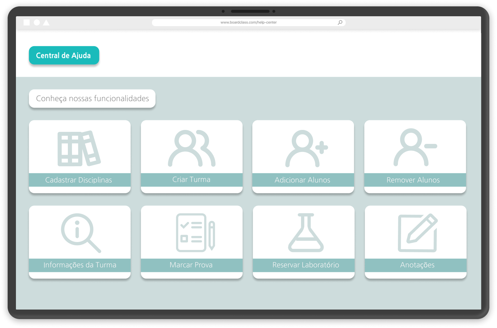
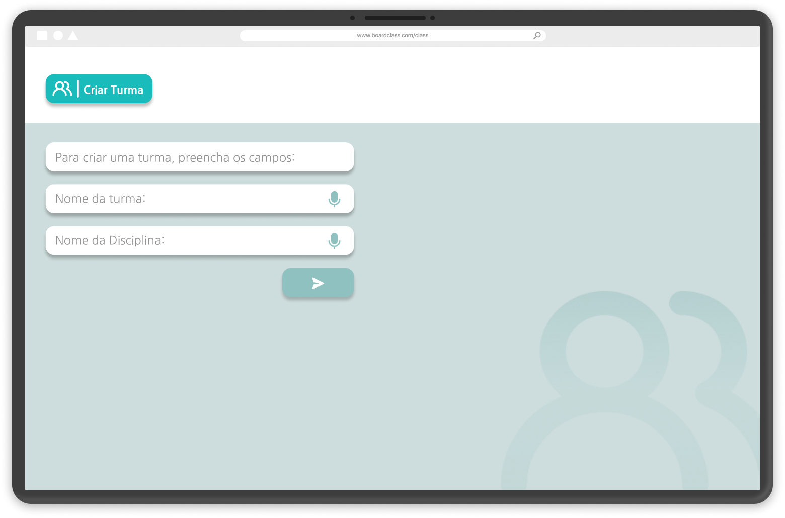
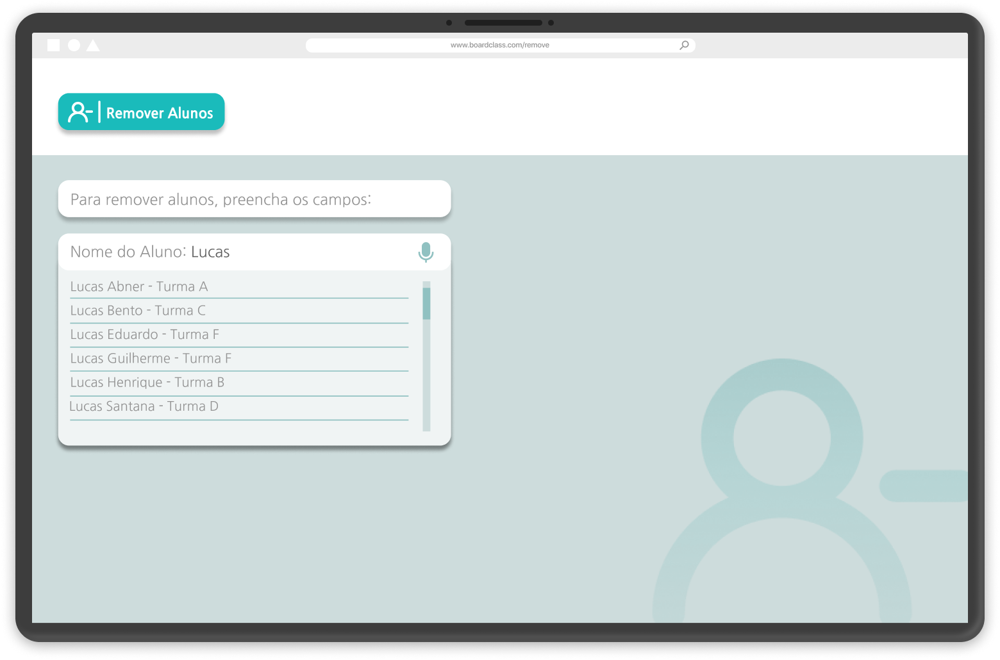
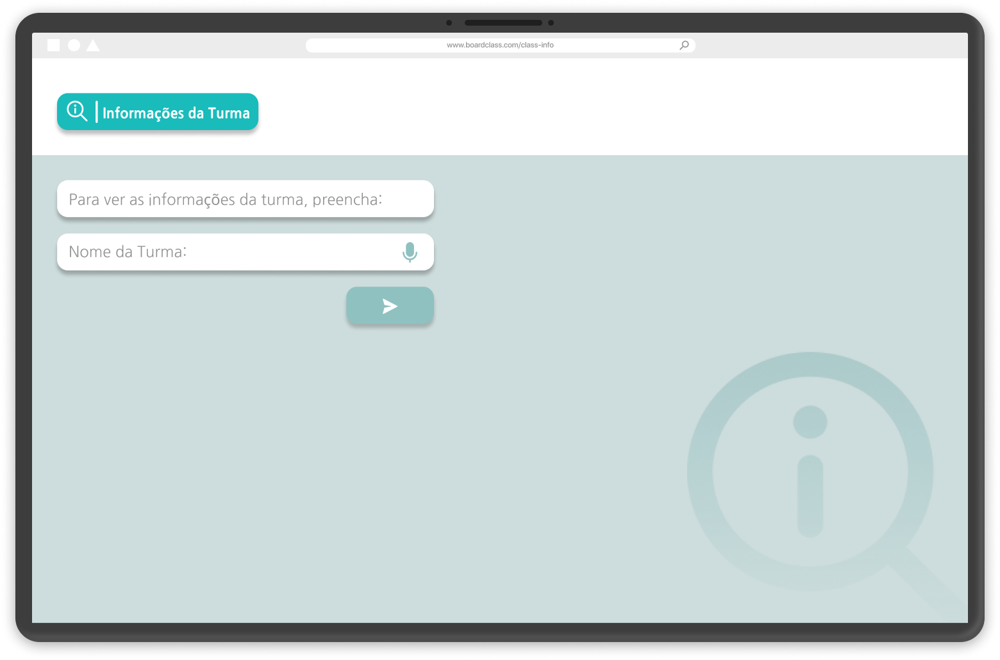
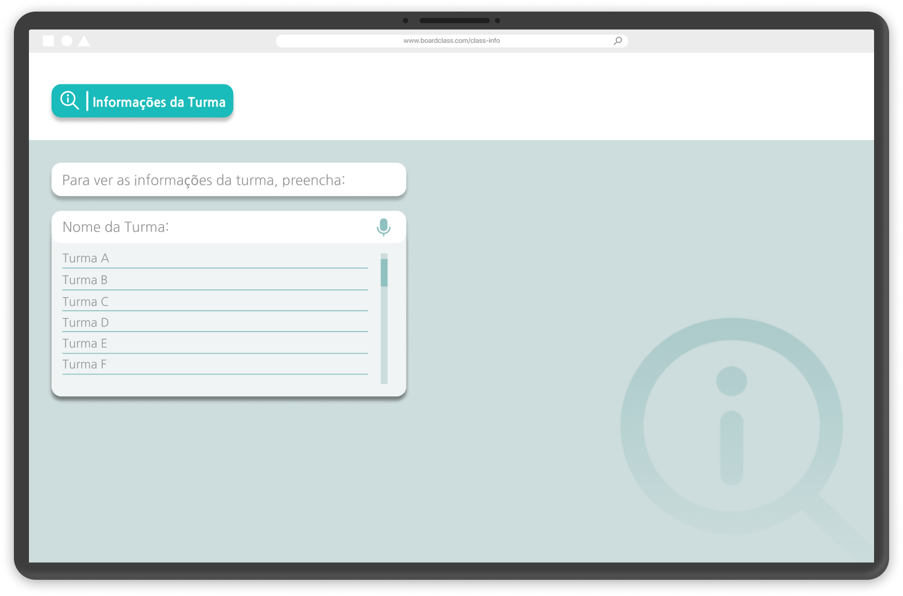
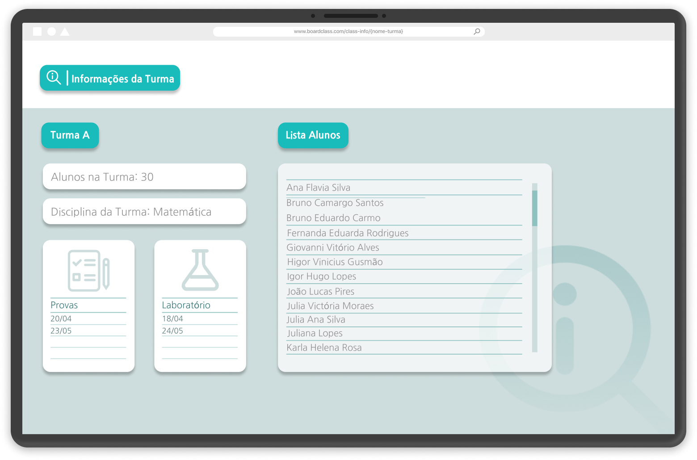
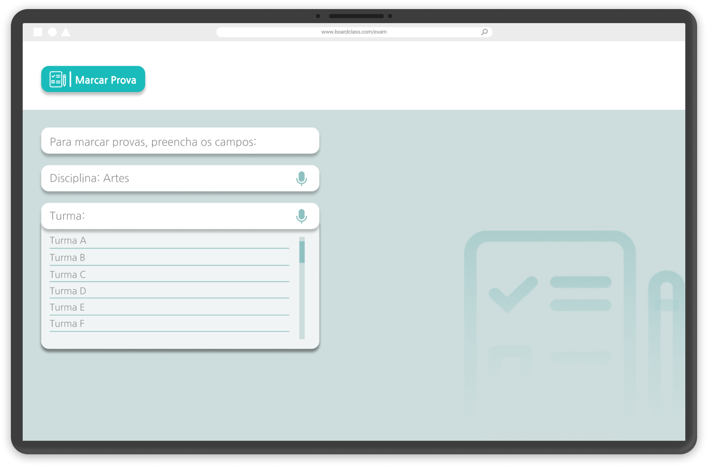
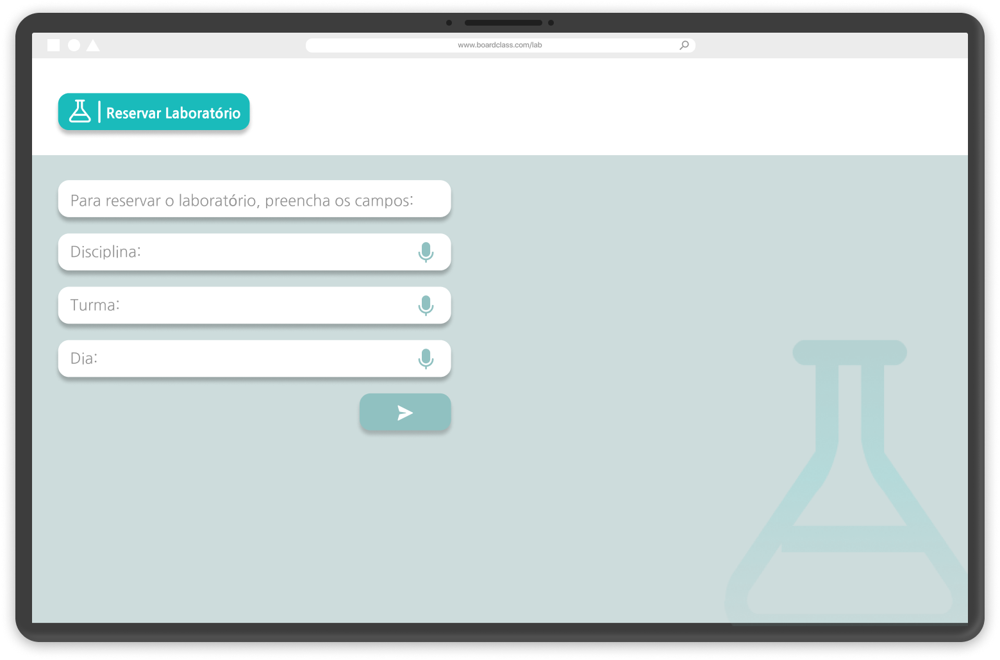

# Assistente Virtual BoardClass

<p align="left">A assistente BoardClass é uma assistente virtual web. Seu objetivo é auxiliar professores com o gerenciamento de turmas e seus respectivos alunos e disciplinas, permitindo a criação de novas turmas/disciplinas, agendamento de provas, adição de novos alunos, entre outras funcionalidades. </p>
<p align="left">Ela funciona recebendo o comando por voz (por meio do professor) e, então, realizando em seguida o que foi pedido. Em alguns casos, é necessário que o professor dê o comando por voz e então tenha que inserir manualmente os dados para que a ação seja concluída. Por exemplo na criação de um aluno, ele deve inserir as informações do aluno por meio do teclado do próprio computador.</p>

<br>

## 🙅‍♂️ Equipe

#### **Equipe Vox**

#### **Integrantes:** Gheovanna Pantaleão, João Vitor Marques, Luciano Pamplona, Silas Rafael

<br>

## 👨‍💻 Tecnologias

#### Este projeto foi desenvolvido com as seguintes tecnologias, bibliotecas e aplicações:

- **Design:** [Figma](https://www.figma.com/)
- **Ecossistema:** [Node.js](https://nodejs.org/en/)
- **Front End:** [React](https://pt-br.reactjs.org/)
- **Back End:** [AdonisJS](https://adonisjs.com/)
- **Banco de dados:** [PostgreSQL](https://www.postgresql.org/)

<br>

## 🕛 Cronograma

#### **Sprint 1:** 25/03 - 14/04

#### **Sprint 2:** 25/04 - 15/05

#### **Sprint 3:** 16/05 - 05/06

<br>

## 📃 Backlog do produto


<br>

## 📄 Sprint backlog

<a href="https://github.com/joaovtmarques/assistente_virtual_boardclass/tree/main/images/backlogs/sprint-backlog1.jpeg">Sprint Backlog 1</a>
<br>
<a href="https://github.com/joaovtmarques/assistente_virtual_boardclass/tree/main/images/backlogs/sprint-backlog2.jpeg">Sprint Backlog 2</a>
<br>
<a href="https://github.com/joaovtmarques/assistente_virtual_boardclass/tree/main/images/backlogs/sprint-backlog3.jpeg">Sprint Backlog 3</a>

<br>

## 📝 Task/Story Board


<br>

## ℹ️ Como usar o aplicativo

### Pré-requisitos

Para clonar e rodar a aplicação, é necessário ter instalado em sua máquina as ferramentas:
[Git](https://git-scm.com), [Node.js](https://nodejs.org/en/) e [Yarn](https://yarnpkg.com/) (opcional).
Além disso, é legal ter um bom editor de código, como o [VSCode](https://code.visualstudio.com/)

### 🎲 Rodando a aplicação

```bash
# Clone este repositório
$ git clone <https://github.com/joaovtmarques/assistente_virtual_boardclass>
# Acesse a pasta do projeto no terminal
$ cd assistente_virtual_boardclass
# Navegue até a pasta 'frontend' e depois até a pasta 'boardclass'
$ cd frontend
$ cd boardclass
# Instale as dependências
$ npm install ou yarn install
# Execute a aplicação
$ npm start ou yarn start
```

<br>

## 🖥️ Mockups

















